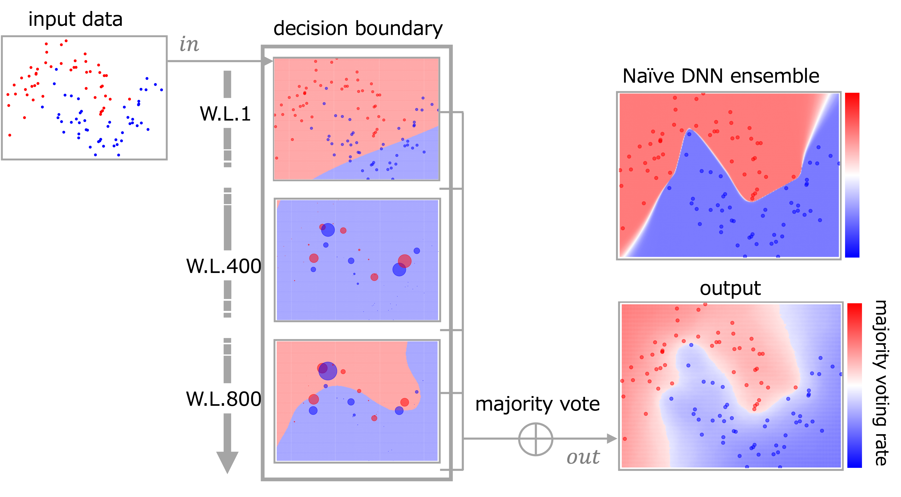

# DNN_Boosting

This repository provides the code for my research [DNN×Boosting] in Pytorch.

[Paper] | [Bibtex] | [Slides]

## Overveiw of Our Method


> Boosting is a method that ensembles weak-learners, which are low-performance models, to construct a strong-learner.
Deep Neural Networks (DNNs) are often strong-learners capable of adequately learning training data, making them generally incompatible with Boosting.
Therefore, we explore a method that intentionally weakens the learning capability of DNNs and utilizes them as weak-learners.
We conduct experimental evaluations using various parameters and datasets and discuss theoretical and practical challenges.

## Requirements 
<!-- All codes are written by Python 3.7, and 'requirements.txt' contains required Python packages. -->
- python >= 3.8
- cuda & cudnn

### prerequisitions
- python 3.8.17
- seaborn  0.12.2
- scikit-learn  1.3.0
- pandas 2.0.3
- Pillow 10.0.0
- torch  2.0.1
- torchvision 0.15.2
- pytorch_transformers
- tqdm  4.65.0
- opencv-python 4.8.0.74
- medmnist 2.2.2
- numpy 1.22.3


To install fast-setup of this code:

```setup
# pytorch install 
pip install torch torchvision torchaudio --index-url https://download.pytorch.org/whl/cu121
pip install -r requirements.txt
```


<!-- ## Dataset -->


## Training & Test

We provide several examples:

### Artificial dataset

- Ours
  
```bash
bash run.sh 
```

### Medmnist (PneumoniaMNIST)
